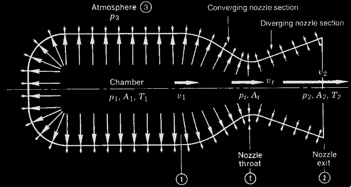

# Requirements:
- Model the thrust fluid conditions of a cold gas thruster
- Affordable at the hobby scale
- Model Supply requirements and run time for a given thruster setup
- Allow different gas storage parameters such as:
	- Fluid Medium
	- Pressure
	- Temperature
- Bonus Research Questions I want to answer:
	- Why Isentropic for choked flow conditions?
	- Can you make a vehicle that can fly for 5-10s from only cold gas propulsion?

# Sources:
- [Rocket Propulsion Elements #9](obsidian://open?vault=sattva&file=Papers%2FRocket%20Propulsion%2FTextbooks%2FRocket%20Propulsion%20Elements%209.pdf)

# Modeling Force!

Force in a nozzle is a product of the momentum of something exiting it. In the case of propulsion systems often these are very small particles of gas, at very high velocities. For a converging diverging nozzle I will use the following symbolic notation in the represented form:

The equation for thrust form the conditions through this system is :
$$\huge F = \dot{m}v_2 + (p_2-p_3)A_2$$

The derivation of this equation is from the Control Volume Approach from refs 2-3 and 2-4 in - [Rocket Propulsion Elements #9](obsidian://open?vault=sattva&file=Papers%2FRocket%20Propulsion%2FTextbooks%2FRocket%20Propulsion%20Elements%209.pdf).

The Chamber conditions are fairly easily defined from the source or tube attached to the system $p_1,A_1,T_1$. Seal Level atmospheric pressure is a great assumption for this project ($p_3$), so really... its just about finding the values for $\dot{m}$,  $v_2$ and $p_2$ given $A_2$.
##### Complete Thrust Equation

Note:
	the symbol $\kappa$ refers to a real gas constant, see : [[WIKI_Heat_capacity_ratio.pdf]]
	in some equations you will see $\gamma$ instead of $\kappa$

To capture the various gas effects going on, we need an equation that allows modification of the chamber geometry, working medium ect. The following equation can be used to perform trades on these various parameters.

Eq 3-29 from [Rocket Propulsion Elements #9](obsidian://open?vault=sattva&file=Papers%2FRocket%20Propulsion%2FTextbooks%2FRocket%20Propulsion%20Elements%209.pdf).
$$\huge F = A_tp_1\sqrt{\frac{2\kappa^2}{\kappa-1}\space\space\space\space(\frac{2}{\kappa+1})^\frac{\kappa+1}{\kappa-1}\space\space\space\space[1-\frac{p_2}{p_1}^\frac{\kappa-1}{\kappa}]} + (p_2 - p_3)A_2$$

This is an awesome equation for an initial design, however there will be need to be able to look at test data and directly compare with predictions. For this the thrust coefficient can be used.

##### Thrust Coefficient

These equations are essentially the same thing as the full thrust equation just shifting things around to make more direct comparisons with data.

Eq 3-30 from [Rocket Propulsion Elements #9](obsidian://open?vault=sattva&file=Papers%2FRocket%20Propulsion%2FTextbooks%2FRocket%20Propulsion%20Elements%209.pdf).
$$\huge C_F = \sqrt{\frac{2\kappa^2}{\kappa-1}\space\space\space\space(\frac{2}{\kappa+1})^\frac{\kappa+1}{\kappa-1}\space\space\space\space[1-\frac{p_2}{p_1}^\frac{\kappa-1}{\kappa}]} + \frac{A_2(p_2-p_3)}{A_tp_1} $$
and combining this with this full thrust equation gives us the final easy to compare formula for test data:

Eq 3-31 from [Rocket Propulsion Elements #9](obsidian://open?vault=sattva&file=Papers%2FRocket%20Propulsion%2FTextbooks%2FRocket%20Propulsion%20Elements%209.pdf)
$$\huge F = C_FA_tp_1$$
or for our use
$$\huge C_F = \frac{F}{A_tp_1}$$
